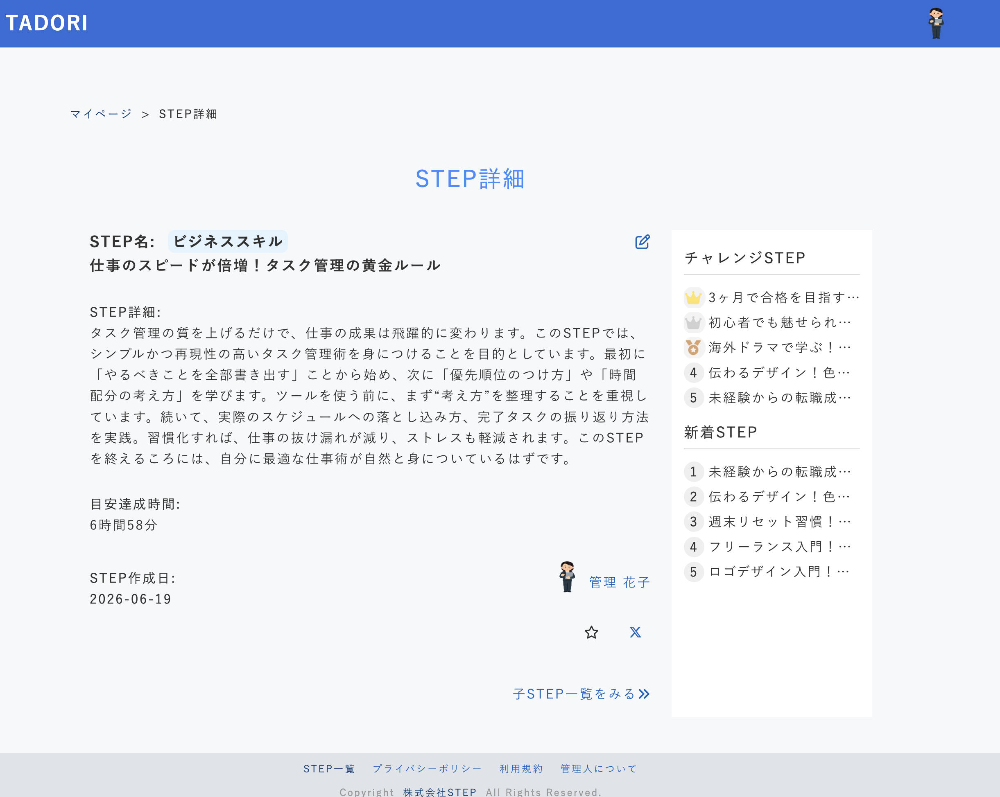
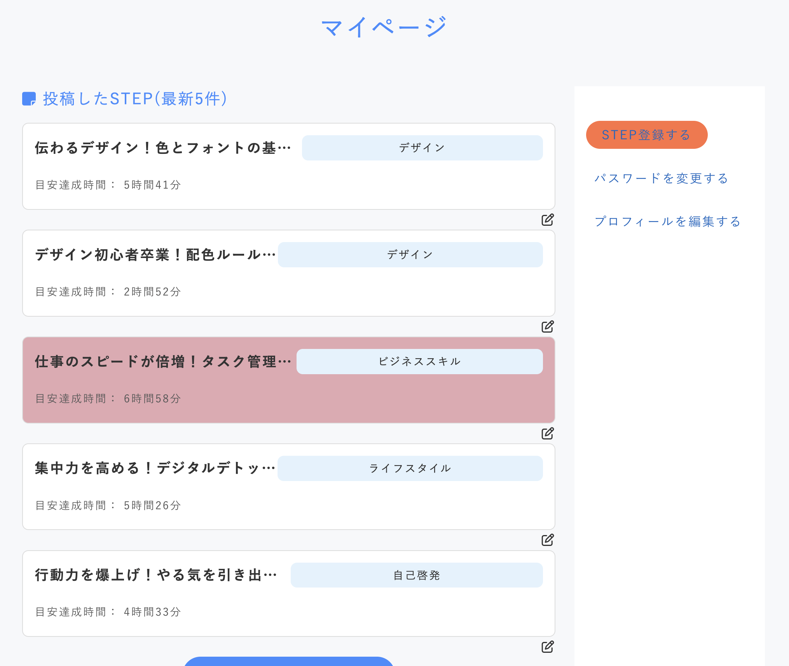
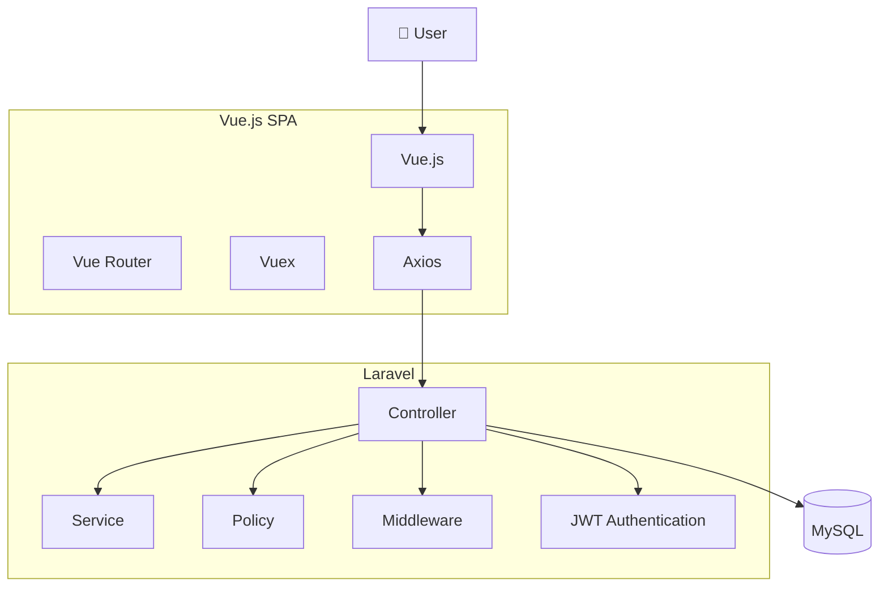
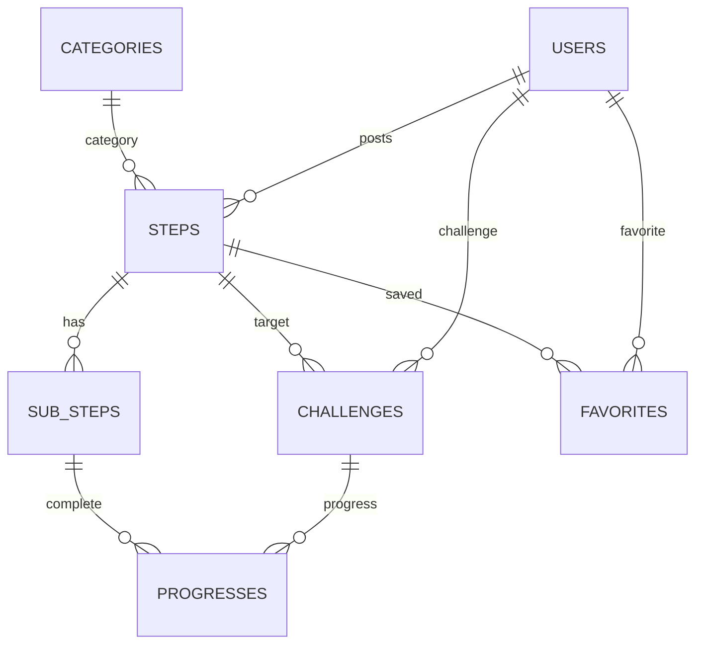

# TADORI


> あなたがたどった学びを、次の人へ

TADORI（たどり）は、資格試験やプログラミング、語学など、自分が歩んだ学習ルートを共有できるWebサービスです。

同じ目標を目指していても、そこへたどり着くまでの学び方は人それぞれ異なります。

本サービスでは、「どの教材を使ったのか」「どの順番で学習したのか」「どこで苦労したのか」といった学習の過程そのものを共有することで、これから挑戦する人の学習をサポートすることを目的としています。

## 概要

Laravel・Vue.jsを用いたSPA開発の学習成果として制作したポートフォリオです。

実際のWebサービス開発を意識し、認証・API設計・状態管理・データベース設計・責務分離など、保守性・拡張性を考慮した構成を目指しました。
---

## 公開情報

- 公開URL：https://tadori.yk-lab.jp/
- Qiita：https://qiita.com/kaz_pro/items/d4bc906bef0183497c3b
- GitHub：https://github.com/i994114/tadori

---

## スクリーンショット

### トップページ


### STEP一覧


### STEP詳細



### マイページ



---

# 開発概要

|項目|内容|
|---|---|
|開発期間|約3か月|
|開発人数|1人|
|開発形態|SPA（Single Page Application）|
|主要ソースコード|約17,000行（PHP・Vue・SCSS）|
|Vueコンポーネント|50|
|REST API|35|
|Controller|16|
|Service|3|
|Model|7|
|Migration|12|
|テーブル数|9|
|デプロイ|Xserver（予定）|

本サービスでは、認証・状態管理・REST API・データベース設計・責務分離など、実際のWebアプリケーション開発で利用される構成を取り入れています。
---

# 主な機能

- ユーザー登録・ログイン・ログアウト
- パスワードリマインダー
- プロフィール編集
- 学習ルート（STEP）の投稿・編集・削除
- サブSTEP管理
- 学習ルート検索
- チャレンジ機能
- 学習進捗管理
- お気に入り機能
- マイページ
- 管理者機能（カテゴリ管理）

---

# 使用技術

|分類|技術|
|---|---|
|フロントエンド|Vue.js 2|
|状態管理|Vuex|
|ルーティング|Vue Router|
|HTTP通信|Axios|
|バックエンド|Laravel 5.8|
|言語|PHP 7|
|認証|JWT Authentication|
|データベース|MySQL|
|CSS|SCSS（FLOCSS設計）|
|画像処理|Intervention Image|
|開発環境|MAMP|
|バージョン管理|Git / GitHub|

---

# システム構成



---

# ER図



---

# 工夫した点

- LaravelとVue.jsを分離したSPA構成
- JWT認証によるログイン機能
- Vuexによる状態管理
- REST API設計
- Serviceクラスへの責務分離
- Policy・Middlewareによる認可制御
- SCSS + FLOCSSによる保守性を意識した設計
- 学習ルート・チャレンジ・進捗管理を考慮したER設計

---

# ディレクトリ構成

```text
app
├── Http
│   ├── Controllers
│   ├── Middleware
│   └── Requests
├── Policies
├── Service
├── User.php
├── Step.php
├── SubStep.php
├── Challenge.php
├── Favorite.php
├── Progress.php
└── Category.php
```

---

# セットアップ

```bash
git clone https://github.com/i994114/tadori.git

cd tadori

composer install

npm install

cp .env.example .env

php artisan key:generate

php artisan migrate --seed

npm run dev

php artisan serve
```

---

# 今後追加したい機能

- コメント機能
- レビュー・評価機能
- 通知機能
- SNSログイン
- タグ検索
- ランキング機能
- 学習履歴の可視化
- テストコードの追加

---

# Author

**Kazuki Yoshida**

- Qiita：https://qiita.com/kaz_pro/items/d4bc906bef0183497c3b
- GitHub：https://github.com/i994114